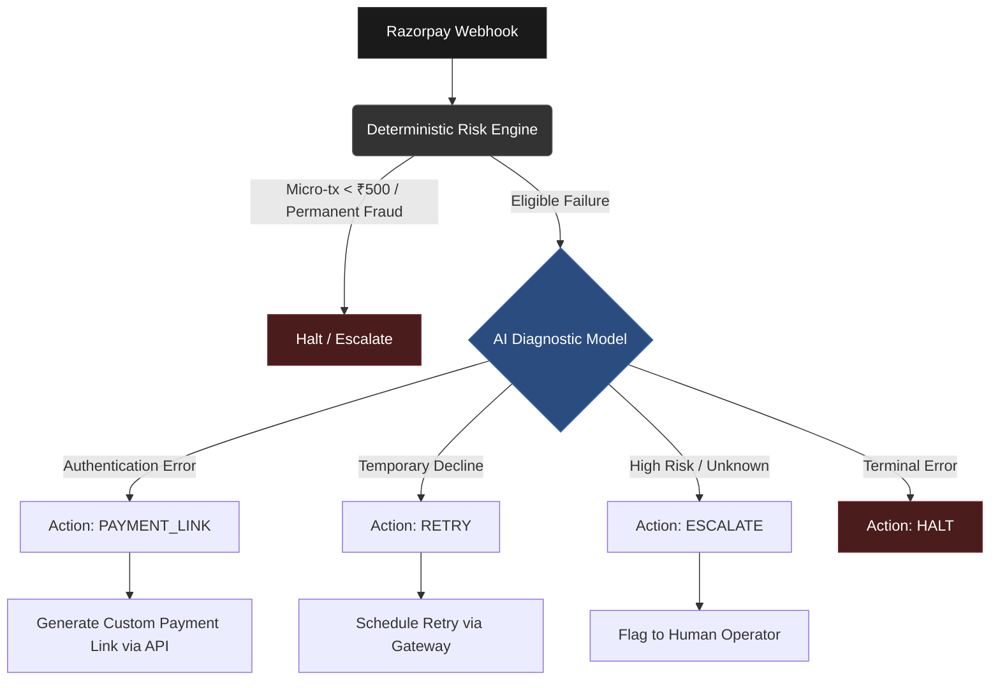

# System Architecture: AI Revenue Recovery Engine

The core pipeline operates on a continuous feedback loop from the Razorpay Webhook, routing through deterministic and probabilistic risk models before autonomous execution.

## Flow Diagram

## Core Philosophy: Risk Engine vs. LLM Synergy

Relying solely on LLMs for financial operations is cost-prohibitive and poses unnecessary risks. This architecture utilizes a **hybrid evaluation model**.

The **Deterministic Risk Engine** acts as the primary gatekeeper. It rapidly filters out non-recoverable transactions (e.g., permanent fraud flags or micro-transactions under ₹500) using hardcoded logic. This ensures cost-efficiency and absolute safety at scale.

The **LLM (OpenRouter/OpenAI)** is invoked *only* for eligible payments. When triggered, the AI Diagnostic Model analyzes the webhook metadata to deduce the root cause, selects the highest-probability recovery channel, and synthesizes dynamic, customer-friendly communication hooks to maximize conversion. 
