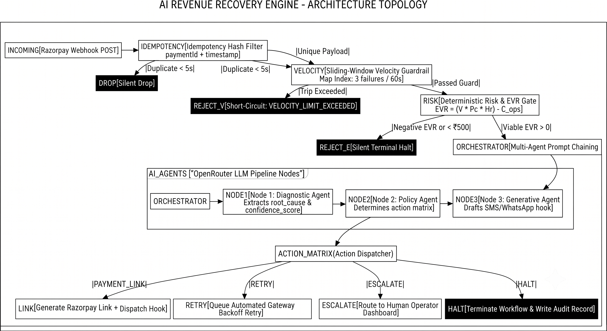

# System Architecture: AI Revenue Recovery Engine

The AI Revenue Recovery Engine is engineered around a strict, non-blocking asynchronous event loop that processes Razorpay webhook payloads. The execution flow strictly enforces the separation of concerns through an ordered gatekeeping sequence, designed for high throughput, robust security, and precise economic viability filtering.

## 1. Core Architectural Pipeline

The system routes incoming webhook payloads through a deterministic gauntlet before handing them off to the probabilistic AI models. This prevents unnecessary token usage and protects against malicious velocity attacks.

### Execution Flow Sequence

$$
\text{Webhook Payload} \longrightarrow \text{Idempotency Guard} \longrightarrow \text{Velocity Guardrail} \longrightarrow \text{EVR Economic Gate} \longrightarrow \text{Multi-Agent AI Chain} \longrightarrow \text{Action Dispatch}
$$

```mermaid
graph TD
    subgraph Ingestion ["1. Ingestion & Security Layer"]
        A[Razorpay Webhook POST] --> B[Idempotency Hash Check: paymentId + timestamp]

```

### 1.1 Ingestion & Idempotency Layer

- **Webhook Interface:** Listens to incoming HTTP POST events (specifically `payment.failed`) from the Razorpay network.
- **Deduplication Matrix:** Implements an in-memory sliding hash index on `paymentId` combined with the event timestamp vector. Duplicate network deliveries firing within a 5-second window are silently short-circuited. This prevents double-processing and redundant token consumption in distributed environments.

### 1.2 Algorithmic Velocity Guardrail (`velocity.guard.ts`)

- **Sliding-Window Rate Limiter:** Operates entirely in memory using a typed dictionary map (`Map<string, number[]>`) indexing client contact points (`customer.email` or `customer.contact`).
- **Threshold Execution:** Maintains a rolling 60-second window. If any single identifier accumulates more than $3$ failure timestamps, the guardrail trips, immediately setting `allowed: false` and short-circuiting the pipeline with a `VELOCITY_LIMIT_EXCEEDED` status code without touching external AI APIs.

### 1.3 Economic Unit-Economics Gate: EVR Model (`risk.engine.ts`)

Before spending compute cycles or LLM tokens on diagnostic analysis, transactions undergo quantitative viability filtering. The **Expected Value of Recovery (EVR)** formula calculates net statistical yield:

$$
\text{EVR} = (V \times P_c \times H_r) - C_{\text{ops}}
$$

**Where:**

- $V$: Transaction amount in INR.
- $P_c$: Default diagnostic confidence baseline ($0.75$ prior to deep-scan, scaling up to $0.98$ post-agent evaluation).
- $H_r$: Historical success probability indexed dynamically from Razorpay error code categories:
  - `payment_timed_out`: $0.85$
  - `authentication_failed`: $0.60$
  - `insufficient_balance`: $0.40$
  - `customer_cancelled`: $0.30$
  - `DEFAULT`: $0.50$
- $C_{\text{ops}}$: Fixed operational overhead baseline ($\text{₹}2.50$ covering LLM token consumption and webhook dispatch routing).

Transactions yielding $\text{EVR} \le 0$ or absolute transaction values below the $\text{₹}500$ floor are dropped instantly to preserve system margins.

## 2. Multi-Agent Prompt Chaining Architecture (`ai.service.ts`)

Instead of relying on a monolithic, single-shot LLM call—which increases token latency and structural hallucination risks—the system decomposes execution into three sequential, isolated nodes communicating via strictly typed JSON payloads.

### Node 1: The Diagnostic Node

- **System Context:** "You are a financial diagnostic AI. Analyze the error and return JSON with root_cause (string) and confidence_score (number 0-1)."
- **Inputs:** `amount`, `reason`, `error_code`
- **Output Schema:**

```typescript
interface DiagnosticOutput {
  root_cause: string;
  confidence_score: number;
}
```

### Node 2: The Business Policy Node

- **System Context:** "You are a risk management AI. Based on the diagnosis, decide the action. Return JSON with action (strictly 'PAYMENT_LINK' | 'RETRY' | 'ESCALATE' | 'HALT') and reasoning (1 sentence)."
- **Inputs:** Diagnostic `root_cause`, `confidence_score`, and active `retry_count`.
- **Output Schema:**

```typescript
interface PolicyOutput {
  action: "PAYMENT_LINK" | "RETRY" | "ESCALATE" | "HALT";
  reasoning: string;
}
```

### Node 3: The Generative Node

- **System Context:** "You are a customer success AI. Return JSON with recommended_channel ('SMS' | 'WHATSAPP' | 'EMAIL' | 'SILENT') and customer_communication_hook (A short, polite 1-sentence message). Only generate a hook if action is PAYMENT_LINK or RETRY."
- **Inputs:** `root_cause`, determined `action`.
- **Output Schema:**

```typescript
interface GenerativeOutput {
  recommended_channel: "SMS" | "WHATSAPP" | "EMAIL" | "SILENT";
  customer_communication_hook: string;
}
```

## 3. Execution Action Protocols

Once the orchestrator synthesizes the multi-agent outputs, the engine maps the decision to one of four rigid operational paths:

- **PAYMENT_LINK:** Triggered when a payment failure requires active client intervention (e.g., authentication drops, expired cards). Instantly generates a secure Razorpay payment URL paired with an optimized communication hook for immediate dispatch.
- **RETRY:** Triggered for transient infrastructure faults (e.g., bank gateway timeouts). Schedules an automated retry sequence while suppressing unnecessary customer notifications to avoid friction.
- **ESCALATE:** Triggered when complex anomaly vectors or high-value transactions exceed automated confidence boundaries. Flags the transaction for manual review in the administrative dashboard.
- **HALT:** Triggered on hard fraud tags, terminal card blocks, or negative EVR scores. Silently terminates execution to preserve compute resources and maintain risk parameters.

## 4. Synthetic Test Injection & Diagnostics

To validate system resilience under deterministic test parameters, the engine includes a local scenario injector (`synthetic-injector.ts`) capable of mocking complex edge-case vectors:

- **Velocity Attack Vectors:** Rapid-fire execution scripts that simulate brute-force card testing payloads to verify sliding-window lockouts and rate limiters.
- **Micro-Transaction Filtration:** Boundary validation ensuring amounts under $\text{₹}500$ and negative EVR calculations bypass LLM evaluation loops entirely.
- **Malformed Payload Handling:** Garbage-string error handling to test fallback defaults (reverting to a safe `HALT` state with `UNKNOWN` root cause mapping).
