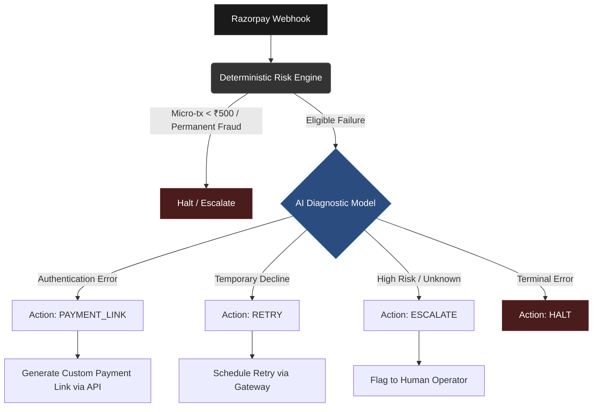

# AI Revenue Recovery Engine

**Autonomous payment failure diagnostics and recovery without human intervention.**

Payment drop-offs due to failures or friction points result in significant lost revenue and customer frustration. The AI Revenue Recovery Engine is an autonomous agent that intelligently evaluates payment failures, diagnoses root causes, and executes the optimal recovery strategy to capture lost funds—seamlessly bridging the gap between failed transactions and successful conversions.

## System Architecture

The core pipeline operates on a continuous feedback loop from the Razorpay Webhook, routing through deterministic and probabilistic risk models before autonomous execution.



## Core Philosophy: Risk Engine vs. LLM Synergy

Relying solely on LLMs for financial operations is cost-prohibitive and poses unnecessary risks. This architecture utilizes a **hybrid evaluation model**.

The **Deterministic Risk Engine** acts as the primary gatekeeper. It rapidly filters out non-recoverable transactions (e.g., permanent fraud flags or micro-transactions under ₹500) using hardcoded logic. This ensures cost-efficiency and absolute safety at scale.

The **LLM (OpenRouter/OpenAI)** is invoked *only* for eligible payments. When triggered, the AI Diagnostic Model analyzes the webhook metadata to deduce the root cause, selects the highest-probability recovery channel, and synthesizes dynamic, customer-friendly communication hooks to maximize conversion. 

## The 10-Scenario Synthetic Test Suite

Validating autonomous recovery logic requires robust simulation. The project ships with a built-in deterministic simulator (`synthetic-injector.ts`) designed to test the system under load. 

The live demo suite continuously injects a stream of synthesized webhook events covering 4 distinct recovery branches:
- **PAYMENT_LINK**: Automatically dispatching recovery links with personalized context.
- **RETRY**: Queueing transactions for later attempts based on transient failure codes.
- **ESCALATE**: Routing complex, edge-case failures to support teams.
- **HALT**: Terminating the workflow for definitive declines.

This suite mathematically proves the AI's contextual decision-making and operational resilience in a controlled environment.

## Quickstart & Local Setup

### 1. Clone & Install

```bash
git clone https://github.com/madhav9757/Razorpay-ai-buildathon.git
cd Razorpay-ai-buildathon

# Install backend dependencies
cd backend
npm install

# Install frontend dependencies
cd ../frontend
npm install
```

### 2. Environment Configuration

Create a `.env` file in the `backend` directory with the following variables:

```env
RAZORPAY_KEY_ID="your_razorpay_key_id"
RAZORPAY_KEY_SECRET="your_razorpay_key_secret"
OPENROUTER_API_KEY="your_openrouter_api_key"
```

Create a `.env` file in the `frontend` directory:

```env
VITE_API_BASE_URL="http://localhost:3000"
```

### 3. Start Development Servers

Run the backend API and webhook listeners:

```bash
cd backend
npm run dev
```

In a new terminal window, boot the React frontend:

```bash
cd frontend
npm run dev
```
